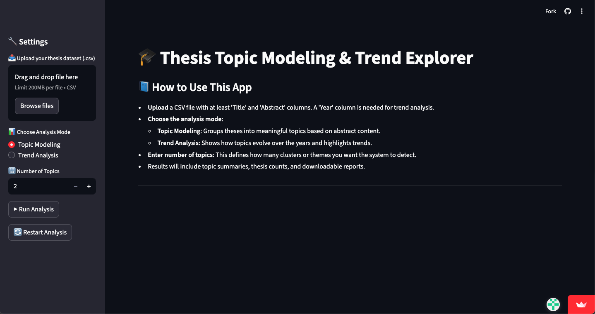
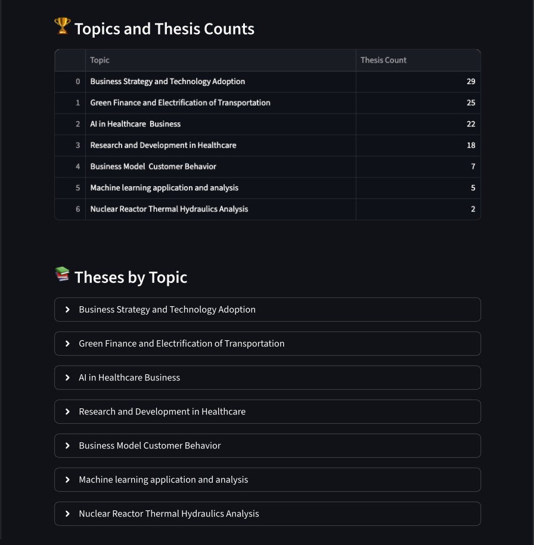
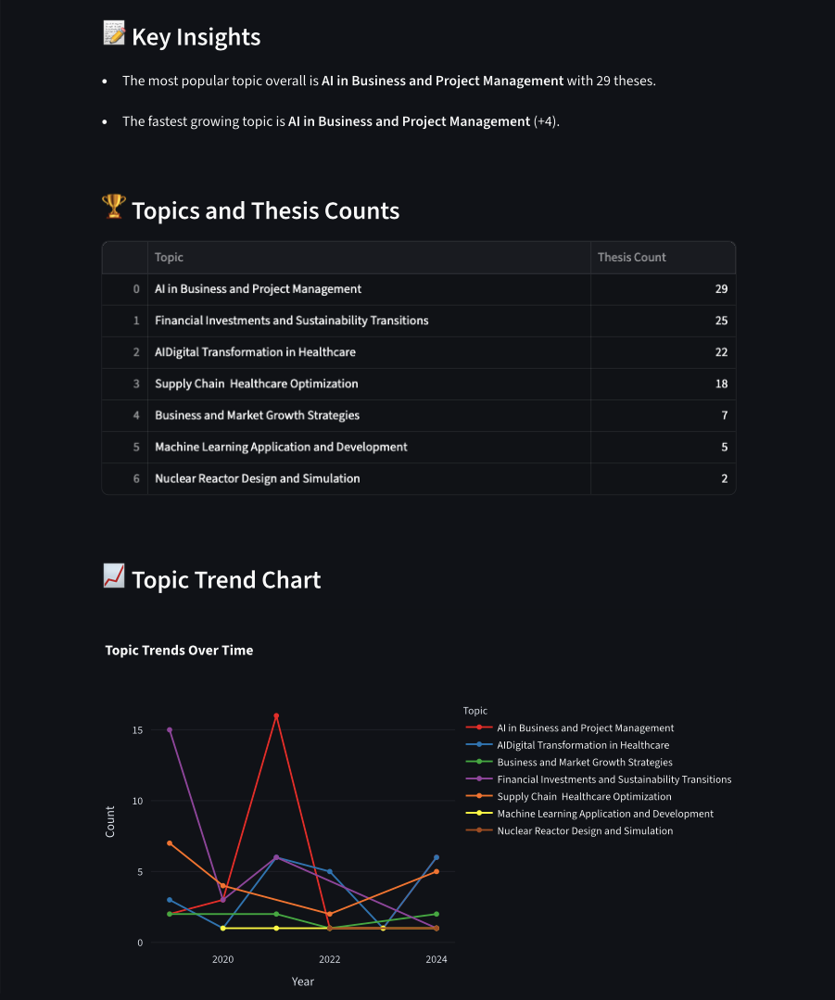

# AI-Assisted Topic Modeling & Trend Detection Tool

**Author**: Hania Bakhsh

**Affiliation**: KTH Royal Institute of Technology, Sweden

**Thesis Title**: AI-Assisted Topic Modeling for Academic Research: Evaluating AI Adoption through the Lens of Interpretability, Trust, and Legitimacy


This project is a research prototype developed as part of my Master's thesis at KTH Royal Institute of Technology.

The tool analyzes academic thesis datasets to automatically identify research topics and visualize how these topics evolve over time. By combining semantic text embeddings with AI-assisted labeling, it provides an interpretable and interactive way to explore research trends.


## Screenshots

### Upload and Analysis Mode Selection


### Topic Modeling Results


### Trend Analysis



## Overview

The prototype demonstrates how AI techniques can support literature analysis by automating topic discovery and trend detection in academic texts.

It is implemented as a lightweight web application built with Python and Streamlit. The app processes thesis abstracts, groups them into semantically similar clusters, and generates readable topic labels to help users interpret the results.

Key components include:

- **Sentence-BERT embeddings** for semantic text representation and clustering
- **Gemini API** for generating human-readable topic names
- **Interactive visualizations and HTML reports** for exploring and exporting results


## Tech Stack

- Python
- Streamlit (web interface)
- Sentence-BERT embeddings (semantic clustering)
- Gemini API (AI-assisted topic labeling)
- Plotly (interactive visualizations)
- HTML report generation


## Project Structure

| File or Folder               | Purpose                                                                                        |
| ---------------------------- | ---------------------------------------------------------------------------------------------- |
| `app.py`                     | Streamlit frontend – handles file upload, analysis mode, visualization, and report download    |
| `main_backend.py`            | Backend – preprocessing, embedding generation, clustering, topic labeling, and report creation |
| `trend_report_template.html` | HTML template used for report export                                                           |
| `requirements.txt`           | Python package dependencies                                                                    |


## Installation and Setup

### Requirements

* Python 3.10 or newer
* Google account (for Gemini API key)
* Streamlit (installed via requirements.txt)

### Step-by-Step Installation

1. Clone or extract the project

2. Install dependencies

   ```bash
   pip install -r requirements.txt
   ```

3. Create an `.env` file

   In the root directory, create a file named `.env` and add:

   ```
   GEMINI_API_KEY=your_api_key_here
   ```

4. Run the app locally

   ```bash
   streamlit run app.py
   ```

   Streamlit will open the web app automatically in your browser.


## Obtaining a Gemini API Key

1. Visit [https://makersuite.google.com/app/apikey](https://makersuite.google.com/app/apikey).
2. Sign in with your Google account.
3. Click **Create API key** and copy the generated key.
4. Paste it into your `.env` file as shown above.

**Note:** Do not share your API key publicly or include it in your commits.
If deploying online, store it securely using Streamlit’s **Secrets Management** feature.


## Hosting on Streamlit Cloud

To deploy the app so others can access it via a public link:

1. Upload the project to a GitHub repository.

2. On [Streamlit Cloud](https://streamlit.io/cloud), create a new app and connect your repository.

3. In **Settings → Secrets**, add your Gemini API key:

   ```toml
   GEMINI_API_KEY = "your_api_key_here"
   ```

4. Set `app.py` as the entry point and deploy.

If you prefer to run locally, use:

```bash
streamlit run app.py
```


## Input Format

The tool accepts a CSV file with the following columns:

| Column     | Description                                |
| ---------- | ------------------------------------------ |
| `Title`    | Thesis title                               |
| `Abstract` | English abstract (used for modeling)       |
| `Year`     | Publication year (used for trend analysis) |


## How to Use

1. Launch the app (`streamlit run app.py`).
2. Upload your dataset (CSV format).
3. Choose an analysis mode:
   * **Topic Modeling** – Clusters abstracts into themes.
   * **Trend Analysis** – Visualizes topic frequency over time.
   
4. Adjust parameters:
   * Set the number of topics (`k`) in Topic Modeling mode.
   
5. Explore results interactively:
   * Clickable tables of topics and theses.
   * Trend charts of topic frequency over years.
   
6. Download an HTML report for offline viewing.


## Key Features

* Sentence-BERT embeddings for semantically coherent clustering
* Gemini-based topic naming for readable, human-aligned labels
* Searchable, sortable tables linking topics and theses
* Downloadable HTML reports
* Lightweight, interpretable design focused on human-centered usability


## Ethical and Practical Notes

* The tool processes publicly available academic data (e.g., KTH DiVA).
* No personal or sensitive data is collected or stored.
* Gemini API may transmit abstracts to Google servers for labeling — use only non-confidential data.
* Always cite and acknowledge the tool when reused or extended.


## Citation

If re-using or extending this prototype, please cite:

Bakhsh, H. (2025).  
*AI-Assisted Topic Modeling for Academic Research: Evaluating AI Adoption through the Lens of Interpretability, Trust, and Legitimacy.*  
KTH Royal Institute of Technology.
